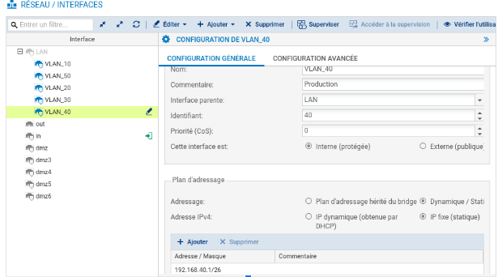
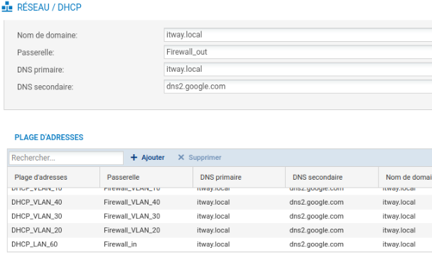
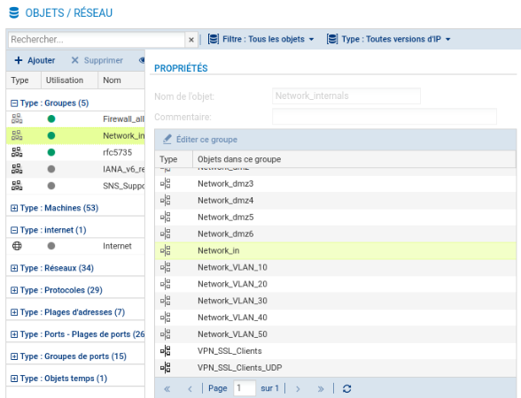
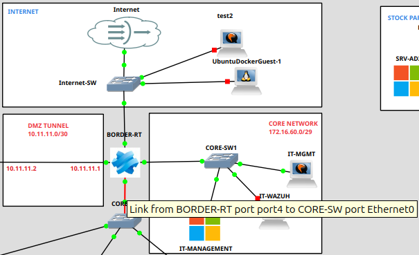
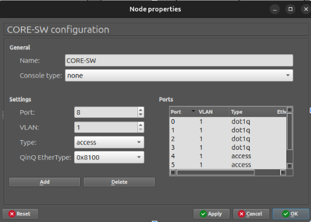

## 1\. Architecture réseau virtualisée – Contexte & Objectifs

Dans le cadre de ce projet, l'infrastructure réseau est entièrement virtualisée sous GNS3. Elle simule l’environnement informatique d’une entreprise multisite. Le réseau est conçu pour assurer :

- La séparation des usages par VLAN  
- Une DMZ sécurisée  
- L’utilisation d’un pare-feu Stormshield pour le filtrage, la segmentation, le routage inter-VLAN et le NAT  
- Un plan d’adressage documenté

La mise en place de VLANs permet une isolation stricte entre les différents services, services utilisateurs et serveurs. Les routeurs Stormshield gèrent :

- Le routage inter-VLAN  
- Le filtrage par règles de firewall  
- Le DHCP spécifique à chaque segment réseau  
- Les flux autorisés entre DMZ et VLAN, ainsi que vers et depuis internet.  
- Le trafic vers la DMZ et Internet qui transite par les routeurs BORDER-RT ↔ DMZ-RT

BORDER-RT est le routeur frontalier qui fait la jonction entre le réseau interne (LAN) et l'extérieur (Internet).

DMZ-RT est le routeur qui fait la jonction entre la DMZ et les autres zones (réseau interne et Internet).

---

##  2\. Résumé de la configuration NAT

**Accès à la configuration** :

- Aller à **Configuration \> Security Policy \> Filter NAT \> NAT**.  
- Créer une **nouvelle règle NAT** (Simple Rule) et l’éditer.  
  **Paramétrage** :  
- **Général** : Activer la règle, définir **Source** : *Network Internals*, **Source Port** : *Any*.  
- **Original Destination** : Sélectionner *Internet*, **Destination Port** : *Any*, **Outgoing** : *Out*.  
- **Translated Source** : Utiliser *Firewall\_out*, **Source Port** : *Ephemeral FW*, activer *Random port*.  
- **Translated Destination** : *Any*.  
- **Politique par défaut** : Configurer **Filter NAT \> Default Policy** sur *Pass*.  
    
  **Test** : Un ping vers 8.8.8.8 depuis un PC interne a été effectué. Le ping fonctionne donc la configuration NAT est correcte.

##  3. Plan d’adressage et VLANs

| VLAN | Interface | Plage DHCP | Gateway |
| ----- | ----- | ----- | ----- |
| IT | VLAN10 | 172.16.10.4 \- 172.16.10.6 | 172.16.10.1 |
| DIR | VLAN20 | 192.168.20.2 \- 192.168.20.14 | 192.168.20.1 |
| COM | VLAN30 | 192.168.30.2 \- 192.168.30.14 | 192.168.30.1 |
| PROD | VLAN40 | 192.168.40.2 \- 192.168.40.62 | 192.168.40.1 |
| SRV | VLAN50 | 172.16.50.5 \- 172.16.50.6 | 172.16.50.1 |

## 4. Configuration des VLANs sur Stormshield

Les VLANs sont configurés directement dans le Stormshield, en utilisant les interfaces VLAN virtuelles sur le port LAN.

Exemple : configuration pour VLAN 40 (Production) :

## 5. Configuration du DHCP sur Stormshield

Sur Stormshield :

- Objet réseau DHCP-VLAN40 défini  
- Exclusion de la passerelle (192.168.40.1)  
- Attribue automatiquement des IPs dans la plage définie  
- DNS primaire/secondaire (IPs du serveur AD et AD2 si elle existait)

## 6. Gestion des objets sur Stormshield

L’utilisation d’objets Stormshield est essentielle pour la lisibilité et la réutilisation dans les règles de sécurité :

- **Objets IP** (réseaux, hôtes, plages)  
- **Objets interface** (VLANs, ports)  
- **Objets services** (HTTP, SMTP, etc.)  
- **Groupes d’objets** (pour simplifier les ACLs)  
- …

## 7. Sécurité – Bonne pratique sur les ports

Une configuration importante sur Stormshield a été effectuée :

**Port 4 :** port physique désactivé, mais les VLANs associés restent fonctionnels.

- Cela évite d’attribuer une IP au port physique, donc réduit la surface d’attaque.  
- Les VLANs sont encapsulés dans le port trunk mais le port en lui-même n’est pas exposé.

## 8. Configuration des switchs

**CORE-SW** :

- Les ports uplink vers d’autres VLANs ou vers le routeur sont en mode trunk (dot1q)  
- Le port vers le switch des serveurs (SW-SRV) est aussi e**n trunk**  

**SW-SRV** :

- Le port vers le CORE-SW est en trunk (dot1q)  
- Le port vers la machine du VLAN 40 est en mode access, VLAN 40

## 9. Règles de pare-feu

### 9.1 Objectif 

Mettre en place une politique de filtrage rigoureuse sur les deux routeurs pare-feu de l’infrastructure.

La politique de base repose sur le principe de refus par défaut (Deny All) : seuls les flux strictement nécessaires sont autorisés.  
Les règles sont organisées par zone logique (INTERNET, DMZ NETWORK, DMZ-TUNNEL, LAN-NETWORK, IT-NETWORK, SRV-NETWORK et CORE-NETWORK) et fondées sur le principe du moindre privilège : aucun service superflu ne doit être accessible.