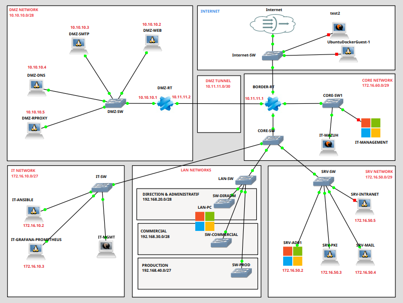

# Conception de l’Infrastructure

## Démarrage du projet

Au lancement du projet, nous avons décidé de commencer par une phase de conception théorique et visuelle de l’infrastructure. Pour cela, nous avons utilisé **GNS3** afin de **simuler l’ensemble du réseau**, en tenant compte des besoins exprimés dans le cahier des charges.

Notre objectif était de visualiser les différents sous-réseaux, leurs interconnexions, les points critiques de sécurité, ainsi que les futurs services à déployer. Cela nous a permis de valider l’architecture globale avant toute mise en œuvre technique.

---

## Plan d’adressage réseau

Une fois le schéma général établi, nous avons réfléchi à un **plan d’adressage IP cohérent**, adapté à la segmentation proposée dans le cahier des charges. Nous avons attribué un **plage IP distincte à chaque sous-réseau fonctionnel** :

- CORE-NETWORK : pour le routage et la sécurité centrale (pare-feu Stormshield),
- SRV-NETWORK : pour les serveurs internes (PKI, AD, Intranet, Mail...),
- IT-NETWORK : pour l’administration et les outils internes (Ansible, Grafana...),
- DMZ-NETWORK : pour les services accessibles depuis Internet (Web, SMTP, DNS, Reverse Proxy),
- LAN-NET-* : pour les postes clients des différents services internes (Communication, Direction, Production).

L’adressage a été pensé de manière à :

- Favoriser la lisibilité et la maintenance,
- Prévoir des plages suffisantes pour l’évolution future,
- Répondre aux contraintes de filtrage et de routage définies dans les politiques de sécurité.

---

## Validation et itérations

Le schéma GNS3 et le plan d’adressage ont été revus et ajustés à plusieurs reprises en fonction des **retours internes** et des contraintes techniques rencontrées lors de la phase de déploiement. Ce travail préparatoire nous a permis de **gagner en efficacité** lors de l’implémentation réelle et d’assurer une **cohérence globale de l’architecture**.

---

## Tableau d'adrressage

|              **Réseau / VLAN**              | **Adresse réseau** | **Broadcast** | **Passerelle** | **Nb total d’IP** |          **Plage DHCP**           |                                          **IPs réservées (statiques)**                                           |                 **Observations**                  |
| :-----------------------------------------: | :----------------: | :-----------: | :------------: | :---------------: | :-------------------------------: | :--------------------------------------------------------------------------------------------------------------: | :-----------------------------------------------: |
|        **DMZ NETWORK** (Réseaux)         |   10.10.10.0/29    |  10.10.10.15  |   10.10.10.1   |         8         |                 -                 | **DMZ-SMTP** : 10.10.10.3 **DMZ-DNS** : 10.10.10.4 **DMZ-RPROXY** : 10.10.10.5 **DMZ-WEB** : 10.10.10.2 |   La DMZ doit être sécurisée avec ACL/pare-feu    |
|         **STORM-NET** (Réseaux)          |   10.11.11.0/30    |               |   10.11.11.1   |         4         |                 -                 |                              **BORDER-RT** : 10.11.11.1  **DMZ-RT** : 10.11.11.2                              |          Tunnels entre les deux routeurs          |
|        **IT  NETWORK ** (VLAN 10)        |   172.16.10.0/29   |  172.16.10.7  |  172.16.10.1   |         8         |     172.16.10.4 → 172.16.10.6     |                          **IT-ANSIBLE** :  172.16.10.2  **IT-GRAFANA** : 172.16.10.3                          |      Réseau d’administration et supervision       |
| **DIRECTION & ADMINISTRATRIF** (VLAN 20) |  192.168.20.0/28   | 192.168.20.15 |  192.168.20.1  |        16         | 192.168.20.2 ->  192.168.20.14 |                                                        -                                                         |                                                   |
|       **COMMERCIAUX**   (VLAN 30)        |  192.168.30.0/28   | 192.168.30.15 |  192.168.30.1  |        16         | 192.168.30.2 ->  192.168.30.14 |                                                        -                                                         |                                                   |
|        **PRODUCTION**   (VLAN 40)        |  192.168.40.0/26   | 192.168.40.63 |  192.168.40.1  |        64         | 192.168.40.2 ->  192.168.40.62 |                                                        -                                                         |                                                   |
|        **SRV NETWORK**  (VLAN 50)        |   172.16.50.0/29   |  172.16.50.7  |  172.16.50.1   |         8         |     172.16.50.5 → 172.16.50.6     |            **SRV-MAIL** : 172.16.50.4 **SRV-INTRANET** : 172.16.50.3 **SRV-AD01** : 172.16.50.2            |        Serveurs internes, accès restreint         |
|       **CORE NETWORK**  (VLAN 60)        |   172.16.60.0/30   |               |  172.16.60.1   |         4         |                 -                 |                              **BORDER-RT** : 172.16.60.1 **WAZUH** : 172.16.60.2                              | Réseau consacré à Wazuh et le routeur Stormshield |

> La DMZ est en dehors du LAN principal, connectée via Stormshield isolée pour maximiser la sécurité.