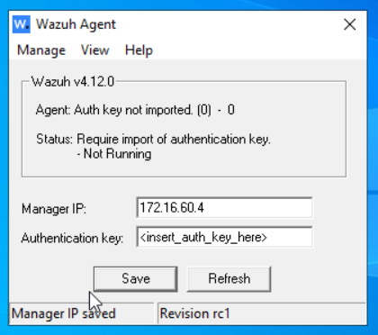
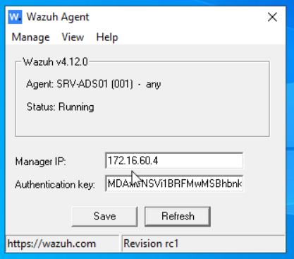
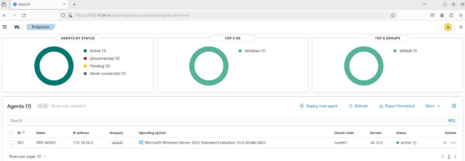

# **Intégration de Wazuh dans l’infrastructure itway**

## **1\. Présentation de Wazuh dans le projet**

### **1\. Qu’est-ce que l’outil Wazuh ?**

Dans le cadre de notre infrastructure réseau sécurisée virtualisée sous GNS3, Wazuh joue un rôle clé dans la surveillance de la sécurité, la détection d'intrusions, et le monitoring des postes et serveurs critiques (tels que l’Active Directory, les serveurs exposés dans la DMZ ou les hôtes internes Linux).  
 Il s’intègre comme un SIEM, permettant ainsi de collecter, analyser et corréler les logs, détecter des comportements suspects, assurer la conformité, et réagir en cas d’anomalies.

Wazuh se compose de trois éléments principaux :

- **Wazuh Server** : centralise les événements, applique les règles, gère les agents.  
- **Wazuh Indexer** : moteur de recherche basé sur OpenSearch pour stocker et interroger les événements.  
- **Wazuh Dashboard** : interface web d’administration et de visualisation.  
- **Wazuh Agent** : installé sur chaque machine supervisée (serveurs Linux/Windows) pour envoyer les logs au serveur.

### **2\. Pourquoi isoler Wazuh dans un vlan dédié ?**

Le serveur Wazuh :

- centralise les logs de sécurité,  
- contient des informations sensibles sur les machines surveillées (journalisation, alertes, signatures d’attaque, règles de détection),  
- possède des accès aux agents déployés sur l’ensemble des serveurs.

**S’il est compromis, c’est toute la visibilité sécurité du SIEM qui est perdue.**

En l’isolant dans un VLAN, on protège ce nœud stratégique de l’infrastructure contre les mouvements latéraux d’attaquants internes, les infections non ciblées ou les attaques directes depuis la DMZ ou d'autres zones à risque.

Cela permet également de contrôler précisément les flux autorisés entre tous les VLAN de l’infrasructure itway et le VLAN de Wazuh. Ainsi on peut configurer le pare-feu pour autoriser uniquement les communications de type agent → serveur Wazuh et interdire les connexions entrantes depuis toute autre source non autorisée.

## **2\. Configuration réseau de la machine Wazuh**

La machine virtuelle hébergeant la pile Wazuh est configurée avec une IP statique afin d'assurer la fiabilité des communications avec les agents.

**Paramètres réseau** :

- **Adresse IP** : `172.16.60.4`  
- **Masque de sous-réseau** : `255.255.255.248`  
- **Passerelle** : `172.16.60.1`

### **Test de connectivité Internet**

`ping 8.8.8.8`

## **3\. Préparation de la machine Wazuh (Debian/Ubuntu)**

Avant d’installer Wazuh, il est important de mettre à jour le système :

`sudo apt update`  
`sudo apt upgrade`

## **4\. Installation automatisée de Wazuh (serveur complet)**

### **Téléchargement :**
curl -sO https://packages.wazuh.com/4.12/wazuh-install.sh

Exécution du script officiel : 
bash wazuh-install.sh -a

Ce script :
Installe toutes les dépendances
Configure les différents services de Wazuh  (indexer, dashboard, serveur)
Démarre les composants nécessaires

Fin de l’installation :
Voici la confirmation de l’achèvement de l’installation et les identifiants de connexion

## **5\. Connexion à l’interface web**

Accéder à :  
 🔗 `https://172.16.60.4:443`  
 S'authentifier avec les identifiants fournis à la fin de l’installation.

## **6\. Intégration d’un poste Windows (ex. : serveur AD)**

### **Étapes depuis le poste Windows :**

1. Télécharger l’agent `.msi` depuis le [site Wazuh](https://packages.wazuh.com/), l’installer et renseigner l’ip du serveur Wazuh puis **Save** : 

2. Sur l’interface graphique du serveur, renseigner les champs :

- Assign a server address : `itway.local`  
- Select one or more existing groups : `default`

3. Copier la commande en bas de page, puis démarrer le service Wazuh en la collant sur le terminal du serveur Windows :

`NET START WazuhSvc`

Le terminal indiquera que le service a démarré.

4. Sur la fenêtre Wazuh Agent, cliquer sur **Refresh** pour faire apparaître la clé : 

5. Retourner dans l’interface web de Wazuh pour vérifier l’apparition du poste.

## **7\. Intégration d’un poste Linux**

### **a. Installation de GnuPG**

`apt install gnupg`

### **b. Importation de la clé GPG Wazuh**

`curl -s https://packages.wazuh.com/key/GPG-KEY-WAZUH | \`  
`gpg --no-default-keyring --keyring gnupg-ring:/tmp/wazuh.gpg --import`

### **c. Déplacement et permission de la clé**

`mv /tmp/wazuh.gpg /usr/share/keyrings/wazuh.gpg`  
`chmod 644 /usr/share/keyrings/wazuh.gpg`

### **d. Ajout du dépôt Wazuh**

`echo "deb [signed-by=/usr/share/keyrings/wazuh.gpg] https://packages.wazuh.com/4.x/apt/ stable main" \`  
`| tee /etc/apt/sources.list.d/wazuh.list`

### **e. Mise à jour des dépôts et installation de l’agent**

`apt update`  
`WAZUH_MANAGER="172.16.60.4" apt-get install wazuh-agent`

### **f. Activation du service**

`service wazuh-agent start`

### **g. Ajout du module docker-listener** 

L’infrastructure itway hébergeant des conteneurs Docker, il est nécessaire d’activer le module docker listener pour activer leur supervision.

Pour celà il faut éditer le fichier de configuration suivant : 

`nano /var/ossec/etc/ossec.conf`

Ajouter à la fin du fichier :

`<ossec_config>`  
  `<wodle name="docker-listener">`  
    `<interval>10m</interval>`  
    `<attempts>5</attempts>`  
    `<run_on_start>yes</run_on_start>`  
    `<disabled>no</disabled>`  
  `</wodle>`  
`</ossec_config>`  